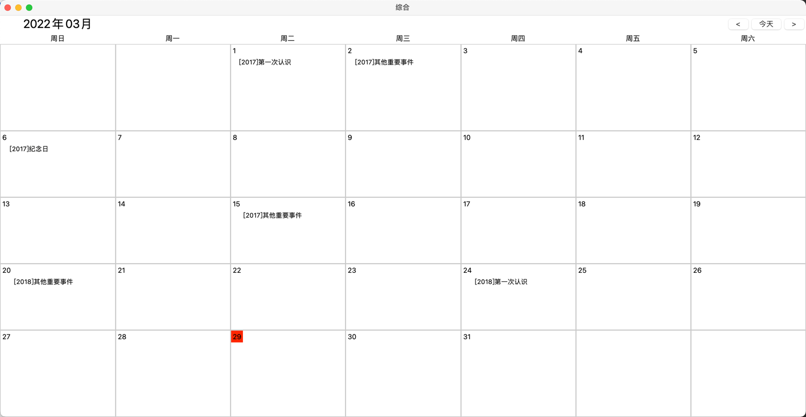

# 中台
## 背景
本项目为python3.* + tkinter 构建的一个简单的窗口程序。数据库为sqlite3。

后面会慢慢添加更多的功能，目前只是为了演示如何使用tkinter构建GUI程序。

## 目前功能
1. 365天 用日历的形式还显示每一年的这一天所发生的事情 回顾值得纪念的事情

## 待实现
1. 365天 的事件添加，不做删除功能 就算是乱写的 过一段时间可能就会有不一样的感觉
2. 账号密码管理功能 记录到本地数据库中 更为安全放心
3. 待办事件 记录到本地 更安全
4. 数据到处备份功能 这样就不用担心数据丢失了

## 更新说明
### 2022-03-29
增加日历控件 翻页查询去年的今天

